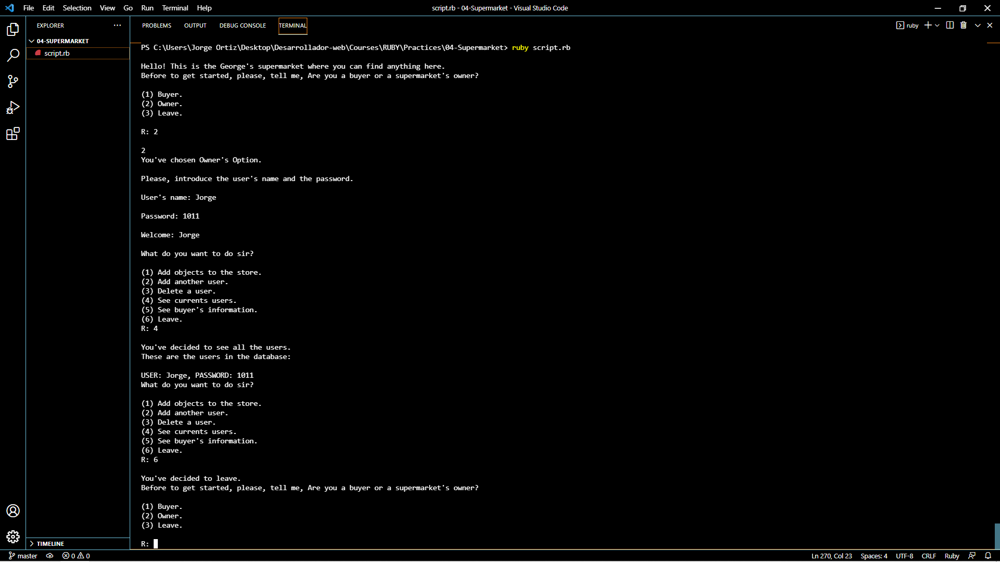

#   PROYECT 10. SUPERMARKET.  

## Author:
- Jorge Ortiz Mata.
- San Luis Potosí S.L.P. México
- ortiz.mata.jorge@gmail.com
- +52 (444) 576 3034.

## Description: 
        In this project we buy or sell books. There are
        different opitions where you can access and define
        what do you wish to do. You can add books to the
        book store's database and buy too.
        
        Take a look to this project. All the information
        and files are in this repository.

## Instructions used:
- Variables.
- Arrays.
- If-Else conditionals.
- Methods.
- Classes.
- While Loops.
- For Loops
- Case.
    
Have a wonderful day! :smiley:
Greetings :love_you_gesture:
        
## Image. 
### **Program execution.** 

